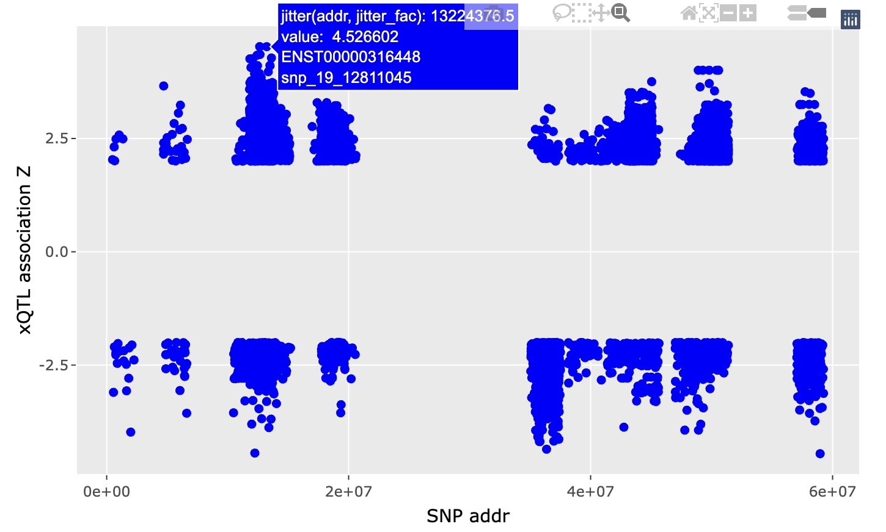

# biocXqtl

Molecular QTLs with bioconductor infrastructure

The purpose of this package is to facilitate statistical
modeling to discover genotype-phenotype patterns like
this one:

For a more comprehensive view of genotype-phenotype associations
in a region, see the "Getting started" vignette for code
producing a plotly display.

