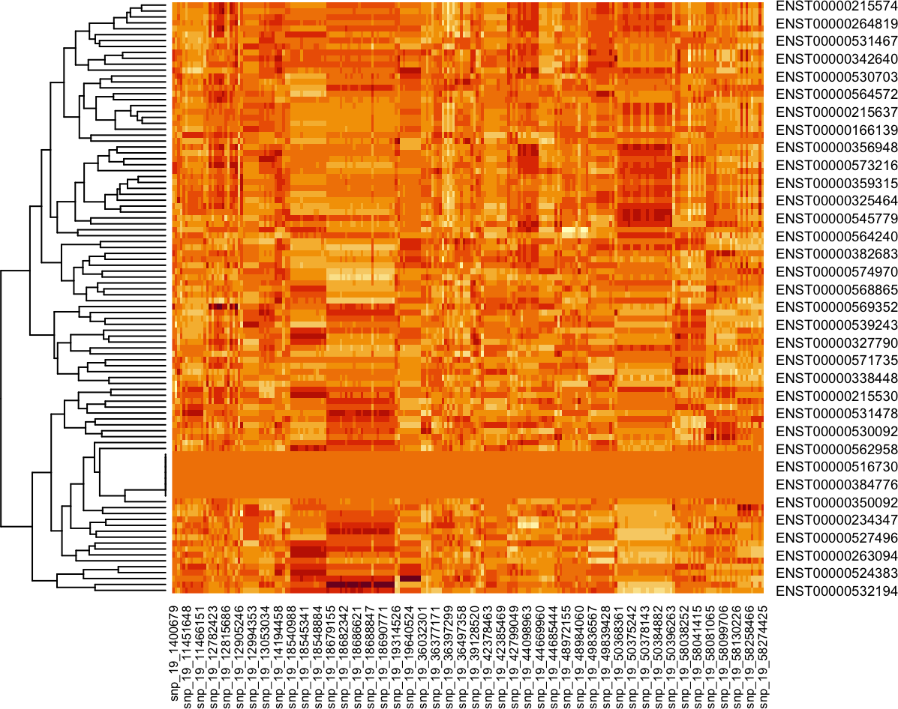
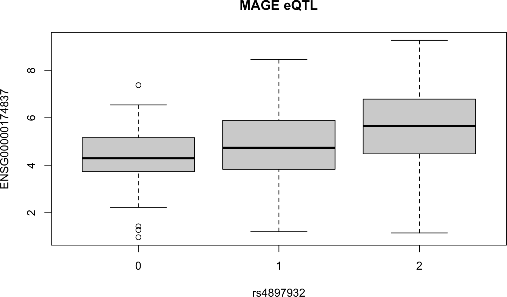

<div id="main" class="col-md-9" role="main">

# biocXqtl: flexible molecular QTL assessment

<div class="section level2">

## Introduction

eQTL analysis generally involves large data volumes of genotype calls.
No standard representation for genotypes has emerged, though VCFs and
plink2 files are frequently encountered.

In this package we provide a flexible approach to estimating
associations between genotype and molecular phenotypes such as gene
expression or DNA methylation. We will use the
RangedSummarizedExperiment structure as the primary element for
structuring the inputs to association test procedures.

</div>

<div class="section level2">

## Preliminary illustration

<div class="section level3">

### Basic data

`geuv19xse` is an extended RangedSummarizedExperiment derived from the
[GeuvadisTranscriptExpr](https://bioconductor.org/package/GeuvadisTranscriptExpr)
package. The assay component provides transcript level counts. Genotypes
are available through the getCalls method.

<div id="cb1" class="sourceCode">

``` r
library(biocXqtl)
```

</div>

    ## Warning: package 'GenomicRanges' was built under R version 4.5.2

<div id="cb3" class="sourceCode">

``` r
data(geuv19xse)
geuv19xse
```

</div>

    ## class: XqtlExperiment 
    ## dim: 4278 91 
    ## metadata(3): snplocs snpaddrs snpchrs
    ## assays(1): counts
    ## rownames(4278): ENST00000545779 ENST00000408051 ... ENST00000313038
    ##   ENST00000401283
    ## rowData names(6): tx_id tx_biotype ... gene_id tx_name
    ## colnames(91): NA06984 NA06985 ... NA12889 NA12890
    ## colData names(0):
    ##   1330 genotype calls present.
    ##   use getCalls() to see them with addresses.

<div id="cb5" class="sourceCode">

``` r
assay(geuv19xse[1:3,1:4])
```

</div>

    ##                    NA06984 NA06985 NA06986 NA06989
    ## ENST00000545779 180.000000      40      58     172
    ## ENST00000408051   0.000000       0       0       0
    ## ENST00000318050   0.805323       0       0       0

<div id="cb7" class="sourceCode">

``` r
rowRanges(geuv19xse[1:3,])
```

</div>

    ## GRanges object with 3 ranges and 6 metadata columns:
    ##                   seqnames            ranges strand |           tx_id
    ##                      <Rle>         <IRanges>  <Rle> |     <character>
    ##   ENST00000545779       18 15254418-15271744      + | ENST00000545779
    ##   ENST00000408051       19       71973-72110      + | ENST00000408051
    ##   ENST00000318050       19     110643-111696      + | ENST00000318050
    ##                               tx_biotype tx_cds_seq_start tx_cds_seq_end
    ##                              <character>        <integer>      <integer>
    ##   ENST00000545779 unprocessed_pseudogene             <NA>           <NA>
    ##   ENST00000408051                  miRNA             <NA>           <NA>
    ##   ENST00000318050         protein_coding           110679         111596
    ##                           gene_id         tx_name
    ##                       <character>     <character>
    ##   ENST00000545779 ENSG00000266818 ENST00000545779
    ##   ENST00000408051 ENSG00000275604 ENST00000408051
    ##   ENST00000318050 ENSG00000176695 ENST00000318050
    ##   -------
    ##   seqinfo: 319 sequences (1 circular) from GRCh38 genome

<div id="cb9" class="sourceCode">

``` r
getCalls(geuv19xse)[1:3,1:4]
```

</div>

    ## GRanges object with 3 ranges and 4 metadata columns:
    ##                  seqnames    ranges strand |   NA06984   NA06985   NA06986
    ##                     <Rle> <IRanges>  <Rle> | <integer> <integer> <integer>
    ##   snp_19_1392636       19   1392636      * |         1         0         0
    ##   snp_19_1393723       19   1393723      * |         0         0         0
    ##   snp_19_1394530       19   1394530      * |         0         0         0
    ##                    NA06989
    ##                  <integer>
    ##   snp_19_1392636         0
    ##   snp_19_1393723         0
    ##   snp_19_1394530         0
    ##   -------
    ##   seqinfo: 1 sequence from an unspecified genome; no seqlengths

</div>

<div class="section level3">

### Filtering and testing with `bind_Zs`

From a computational viewpoint, the simplest assessment of molecular
QTLs involves fitting a linear model to assess additive association of
minor allele dose with the molecular response. From an organizational
viewpoint, a simple approach is to start and end with an XqtlExperiment.
rowRanges will be updated to include Z-scores for tests of association
of each variant with each molecular feature.

<div id="cb11" class="sourceCode">

``` r
m = maf(geuv19xse)
mins = apply(data.matrix(cc <- mcols(getCalls(geuv19xse))), 1, min, na.rm=TRUE)
# also ensure that all possible genotype classes are seen 
ccc = data.matrix(cc)
tt = apply(ccc,1,function(x)length(table(x)))
ok = which(m > .3 & mins > -1 & tt == 3)   # very small sample size
limg = filterCalls(geuv19xse[1:100,], ok)
limg = bind_Zs(limg)
```

</div>

    ## some variants have MAF > 0.5

<div id="cb13" class="sourceCode">

``` r
rowRanges(limg)[1:3,7:10]
```

</div>

    ## GRanges object with 3 ranges and 4 metadata columns:
    ##                   seqnames            ranges strand | snp_19_1400679
    ##                      <Rle>         <IRanges>  <Rle> |      <numeric>
    ##   ENST00000545779       18 15254418-15271744      + |      0.0361026
    ##   ENST00000408051       19       71973-72110      + |            NaN
    ##   ENST00000318050       19     110643-111696      + |      1.1910512
    ##                   snp_19_1400766 snp_19_5694630 snp_19_5696245
    ##                        <numeric>      <numeric>      <numeric>
    ##   ENST00000545779       0.664277     -0.9581762      -1.531837
    ##   ENST00000408051            NaN            NaN            NaN
    ##   ENST00000318050       0.752205     -0.0378885       0.153209
    ##   -------
    ##   seqinfo: 319 sequences (1 circular) from GRCh38 genome

All the Z-scores for tests of association are in the rowRanges of
`limg`. The first 6 elements of the mcols of the rowRanges are related
to annotation. A heatmap of the Z-scores shows a band of transcripts
with all zero counts. Very light tiles correspond to negative Z-scores,
dark tiles to positive.

<div id="cb15" class="sourceCode">

``` r
zs = data.matrix(mcols(rowRanges(limg))[,-c(1:6)])
zs[is.na(zs)] = 0
heatmap(zs, Colv=NA, scale="none")
```

</div>



</div>

<div class="section level3">

### Focused visualization

With some helper functions, the basic data layout can be seen,
illustrating violation of standard linear modeling assumptions
underlying interpretation of the Z-score.

<div id="cb16" class="sourceCode">

``` r
mo = function(x) as.numeric(assay(limg[x,]))
sn = function(x) as.numeric(data.matrix(mcols(getCalls(limg)[x,])))
beeswarm::beeswarm(jitter(mo("ENST00000529442"))~sn("snp_19_19631444"))
```

</div>


</div>

<div class="section level3">

### Visualization of associations over a region

An interactive comprehensive overview of filtered statistics can be
made. For this illustration we start from scratch.

<div id="cb17" class="sourceCode">

``` r
data(geuv19xse)
sds = rowSds(assay(geuv19xse), na.rm=TRUE)
qq = quantile(sds, .8)
ok = which(sds > qq)
lk = geuv19xse[ok,]
mafs = maf(lk) # only snps here
mins = apply(ccc <- data.matrix(mcols(getCalls(lk))), 1, min, na.rm=TRUE) # some -1 values
tt = apply(ccc,1,function(x)length(table(x)))
ok = which(m > .3 & mins > -1 & tt == 3)   # very small sample size
lk = filterCalls(lk, ok)
run1 <- bind_Zs(lk)
```

</div>

    ## some variants have MAF > 0.5

<div id="cb19" class="sourceCode">

``` r
viz_stats(run1)
```

</div>

<div id="htmlwidget-ac96cb3ee4656e2e9ec3"
class="plotly html-widget html-fill-item"
style="width:700px;height:432.632880098888px;">

</div>

Zoom and axis restoration are available with standard plotly controls.

</div>

<div class="section level3">

### Adding a covariatae

`bind_Zs` will use the covariate information present in colData().

For GEUVADIS data in GeuvadisTranscriptExpr, we have collected
sample-level information on sex. Again we start from scratch, filter,
add the covariate information, and compute tests.

<div id="cb20" class="sourceCode">

``` r
data(geuv19xse)
data(geuv19_samples)
sds = rowSds(assay(geuv19xse), na.rm=TRUE)
qq = quantile(sds, .8)
ok = which(sds > qq)
lk = geuv19xse[ok,]
mafs = maf(lk)
mins = apply(ccc <- data.matrix(mcols(getCalls(lk))), 1, min, na.rm=TRUE) # some -1 values
tt = apply(ccc,1,function(x)length(table(x)))
lk = filterCalls(lk,which(mafs>.3 & mins > -1 & tt == 3))
namedSex = geuv19_samples$Sex
names(namedSex) = geuv19_samples[["Sample name"]]
lk$Sex = namedSex[colnames(lk)]
table(lk$Sex)
```

</div>

    ## 
    ## female   male 
    ##     46     45

<div id="cb22" class="sourceCode">

``` r
run2 <- bind_Zs(lk)
```

</div>

    ## some variants have MAF > 0.5

The following display shows that there are SNP:transcript associations
for which adjustment for sample sex can have appreciable effects on
Z-score estimates when absolute value of Z is less than 3 or so.

<div id="cb24" class="sourceCode">

``` r
m2 = data.matrix(as.data.frame(mcols(run2)[,-c(1:6)]))
m1 = data.matrix(as.data.frame(mcols(run1)[,-c(1:6)]))
plot(as.numeric(m1) - as.numeric(m2)~as.numeric(m1), pch=".")
```

</div>


</div>

</div>

<div class="section level2">

## Working with variants from VCF

Thanks to the AWS Open Data project, tabix-indexed VCFs for genotyped
lymphoblastoid cell lines from the 1000 genomes project are
[available](https://registry.opendata.aws/1000-genomes/). Data from the
Multi-Ancestry analysis of Gene Expression are
[available](https://github.com/mccoy-lab/MAGE) via Zenodo or Dropbox. In
our experience the Dropbox link is more performant.

We have acquired the “DESeq2” gene quantifications from the MAGE
archive, and a selection of `release` genotypes from the associated cell
lines.

<div class="section level3">

### Data on expression and genotype

The expression data:

<div id="cb25" class="sourceCode">

``` r
data(mageSE_19)
```

</div>

Genotype data:

<div id="cb26" class="sourceCode">

``` r
dv = demo_vcf()
h = VariantAnnotation::scanVcfHeader(dv)
head(samples(h))
```

</div>

    ## [1] "HG00096" "HG00100" "HG00105" "HG00108" "HG00110" "HG00113"

<div id="cb28" class="sourceCode">

``` r
length(intersect(samples(h), colnames(mageSE_19)))
```

</div>

    ## [1] 731

</div>

<div class="section level3">

### Building an XqtlExperiment

We will focus on SNVs but the genotype information has other types of
variants.

Bind the minor allele counts to the expression data:

<div id="cb30" class="sourceCode">

``` r
mins  = minorAlleleCounts(demo_vcf(), GRanges("19:1-50000000"))
mxx = XqtlExperiment(mageSE_19, mins)
colData(mxx) = NULL
```

</div>

The last command above allows us to compute crude measures of
association. If we populate colData with covariate information, test
procedures in the package will incorporate it.

</div>

<div class="section level3">

### Creating association statistics with visualizations

The following step uses C++ modules to compute association tests for all
genotypes and all gene expression measures in mageSE\_19.

<div id="cb31" class="sourceCode">

``` r
sds = rowSds(assay(mxx), na.rm=TRUE)
qq = quantile(sds, .95)
ok = which(sds > qq)
system.time(zzz <- zs4manyYs(mxx[ok,]))
```

</div>

    ## some variants have MAF > 0.5

    ##    user  system elapsed 
    ##   3.508   0.644   0.846

Here’s a helper function to visualize one association.

<div id="cb34" class="sourceCode">

``` r
onebox = function(xse, mfeat="ENSG00000174837", vnt="rs4897932", title) {
if (missing(title)) title=""
boxplot(split(as.numeric(assay(xse[mfeat,])),
   as.numeric(data.matrix(mcols(getCalls(xse)[vnt,])))),
   ylab=mfeat, xlab=vnt, main=title)
}
onebox(mxx[ok,], title="MAGE eQTL")
```

</div>



We can also visualize interactively:

<div id="cb35" class="sourceCode">

``` r
tmpm = cbind(mcols(rowRanges(mxx[ok,])), zzz)
tmp = mxx[ok,]
mcols(tmp) = tmpm
viz_stats(tmp, midchop=5)
```

</div>

<div id="htmlwidget-e5c8c404fe174e4c81bd"
class="plotly html-widget html-fill-item"
style="width:700px;height:432.632880098888px;">

</div>

</div>

<div class="section level3">

### Covariate adjustment

First we reanalyze with adjustment for continental group.

<div id="cb36" class="sourceCode">

``` r
data(mageSE_19)
sds = rowSds(assay(mageSE_19), na.rm=TRUE)
qq = quantile(sds, .9)
ok = which(sds > qq)
cd = colData(mageSE_19)
mins  = minorAlleleCounts(demo_vcf(), GRanges("19:1-3000000"))
mxx = XqtlExperiment(mageSE_19[ok,], mins)
print(mxx)
```

</div>

    ## class: XqtlExperiment 
    ## dim: 138 731 
    ## metadata(0):
    ## assays(1): logcounts
    ## rownames(138): ENSG00000141934 ENSG00000099812 ... ENSG00000196867
    ##   ENSG00000268107
    ## rowData names(6): gene_id gene_name ... symbol entrezid
    ## colnames(731): HG00096 HG00100 ... NA21129 NA21130
    ## colData names(13): SRA_accession internal_libraryID ...
    ##   RNAQubitTotalAmount_ng RIN
    ##   8465 genotype calls present.
    ##   use getCalls() to see them with addresses.

<div id="cb38" class="sourceCode">

``` r
colData(mxx)=NULL
rowRanges(mxx) = rowRanges(mxx)[,1:6]
mxx$continent = cd$continentalGroup
system.time(zzz <- zs4manyYs(mxx))
```

</div>

    ## some variants have MAF > 0.5

    ##    user  system elapsed 
    ##   6.994   0.860   1.327

<div id="cb41" class="sourceCode">

``` r
mcols(rowRanges(mxx)) = cbind(mcols(rowRanges(mxx)), zzz)
viz_stats(mxx, midchop=5)
```

</div>

<div id="htmlwidget-36aa3d2a04d42bbc2145"
class="plotly html-widget html-fill-item"
style="width:700px;height:432.632880098888px;">

</div>

Then we add sex as well.

<div id="cb42" class="sourceCode">

``` r
data(mageSE_19)
sds = rowSds(assay(mageSE_19), na.rm=TRUE)
qq = quantile(sds, .9)
ok = which(sds > qq)
cd = colData(mageSE_19)
mins  = minorAlleleCounts(demo_vcf(), GRanges("19:1-3000000"))
mxx = XqtlExperiment(mageSE_19[ok,], mins)
mxx$continent = cd$continentalGroup
mxx$sex = cd$sex
system.time(zzz <- zs4manyYs(mxx))
```

</div>

    ## some variants have MAF > 0.5

    ##    user  system elapsed 
    ##  22.733   1.298   3.493

<div id="cb45" class="sourceCode">

``` r
mcols(rowRanges(mxx)) = cbind(mcols(rowRanges(mxx)), zzz)
viz_stats(mxx, midchop=7)
```

</div>

<div id="htmlwidget-febe03efa1a2d8d52a86"
class="plotly html-widget html-fill-item"
style="width:700px;height:432.632880098888px;">

</div>

</div>

</div>

</div>
